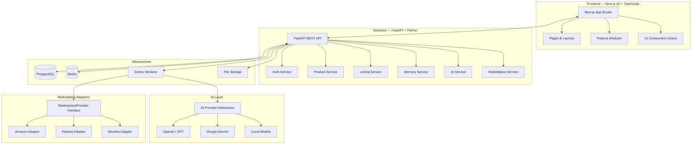
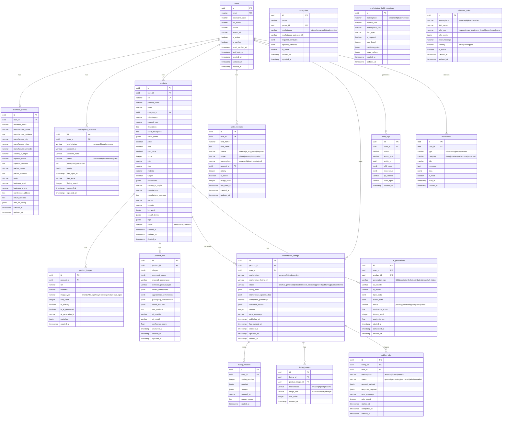
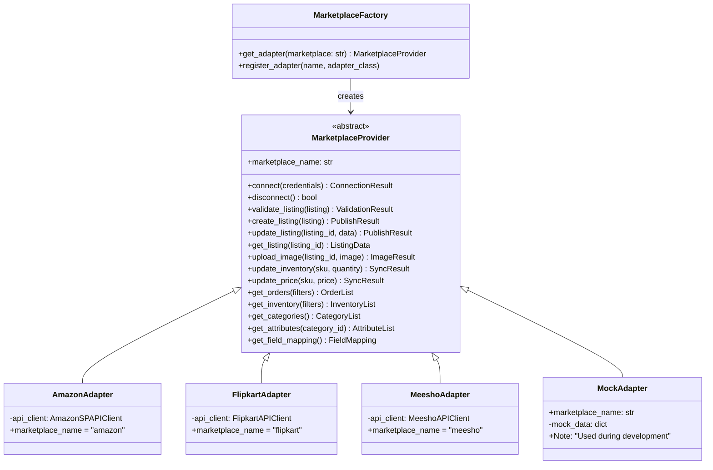
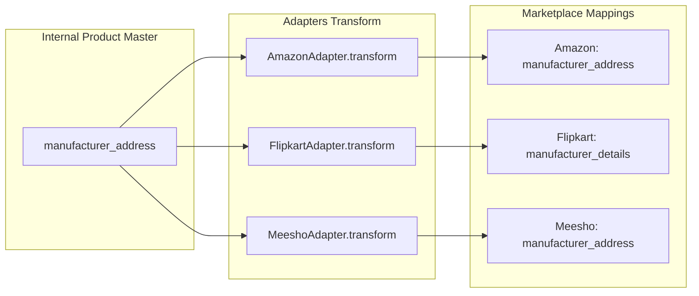
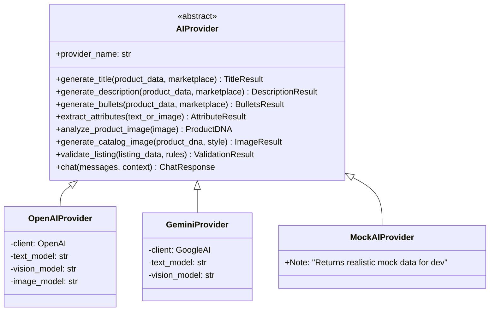
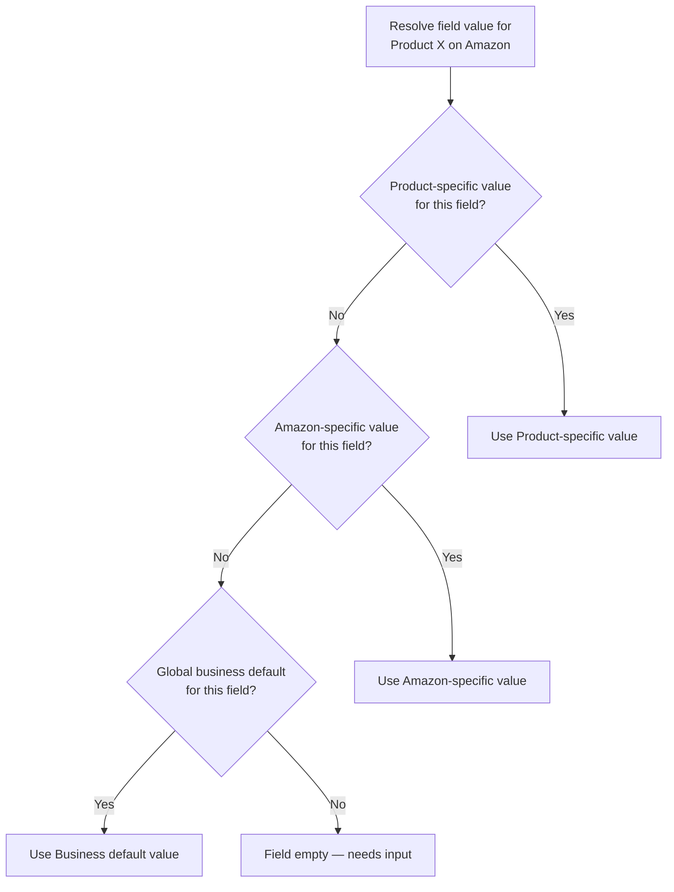
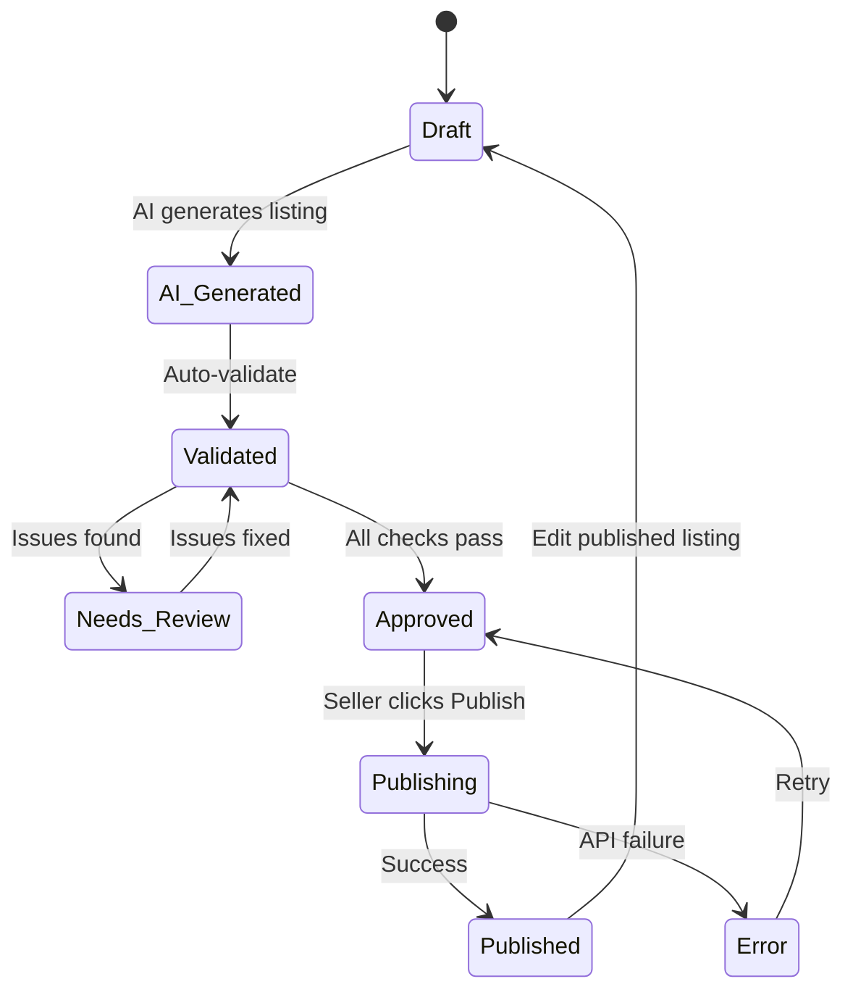

# AI Multi-Marketplace Seller Listing Automation Platform

## Architecture & Implementation Plan

---

## 1. System Architecture Overview



---

## 2. Database Schema (ERD)



---

## 3. Project Folder Structure

### Backend (FastAPI)

```
backend/
├── alembic/                          # Database migrations
│   ├── versions/
│   └── env.py
├── app/
│   ├── __init__.py
│   ├── main.py                       # FastAPI app entry, middleware, lifespan
│   ├── core/
│   │   ├── __init__.py
│   │   ├── config.py                 # Pydantic BaseSettings
│   │   ├── security.py               # JWT, password hashing, auth utils
│   │   ├── database.py               # Async SQLAlchemy engine & session
│   │   ├── exceptions.py             # Custom exception classes
│   │   ├── middleware.py             # CORS, rate limiting, logging
│   │   └── dependencies.py          # FastAPI dependency injection
│   ├── models/                       # SQLAlchemy ORM models
│   │   ├── __init__.py
│   │   ├── user.py
│   │   ├── business_profile.py
│   │   ├── product.py
│   │   ├── product_image.py
│   │   ├── product_dna.py
│   │   ├── marketplace_account.py
│   │   ├── marketplace_listing.py
│   │   ├── listing_version.py
│   │   ├── seller_memory.py
│   │   ├── category.py
│   │   ├── marketplace_field_mapping.py
│   │   ├── validation_rule.py
│   │   ├── ai_generation.py
│   │   ├── publish_job.py
│   │   ├── audit_log.py
│   │   └── notification.py
│   ├── schemas/                      # Pydantic request/response models
│   │   ├── __init__.py
│   │   ├── auth.py
│   │   ├── user.py
│   │   ├── business_profile.py
│   │   ├── product.py
│   │   ├── product_image.py
│   │   ├── product_dna.py
│   │   ├── marketplace.py
│   │   ├── listing.py
│   │   ├── seller_memory.py
│   │   ├── ai.py
│   │   ├── notification.py
│   │   └── common.py                # Pagination, error response, etc.
│   ├── api/
│   │   ├── __init__.py
│   │   └── v1/
│   │       ├── __init__.py
│   │       ├── router.py            # Aggregates all v1 routes
│   │       ├── auth.py
│   │       ├── users.py
│   │       ├── business_profiles.py
│   │       ├── products.py
│   │       ├── product_images.py
│   │       ├── product_dna.py
│   │       ├── marketplace_accounts.py
│   │       ├── listings.py
│   │       ├── seller_memory.py
│   │       ├── ai.py
│   │       ├── categories.py
│   │       ├── notifications.py
│   │       ├── search.py
│   │       └── dashboard.py
│   ├── services/                     # Business logic layer
│   │   ├── __init__.py
│   │   ├── auth_service.py
│   │   ├── user_service.py
│   │   ├── business_profile_service.py
│   │   ├── product_service.py
│   │   ├── product_image_service.py
│   │   ├── product_dna_service.py
│   │   ├── listing_service.py
│   │   ├── listing_generator_service.py
│   │   ├── listing_validator_service.py
│   │   ├── seller_memory_service.py
│   │   ├── marketplace_service.py
│   │   ├── ai_service.py
│   │   ├── image_service.py
│   │   ├── search_service.py
│   │   ├── notification_service.py
│   │   ├── audit_service.py
│   │   └── dashboard_service.py
│   ├── repositories/                 # Database access layer
│   │   ├── __init__.py
│   │   ├── base.py                   # Generic CRUD repository
│   │   ├── user_repo.py
│   │   ├── business_profile_repo.py
│   │   ├── product_repo.py
│   │   ├── product_image_repo.py
│   │   ├── listing_repo.py
│   │   ├── seller_memory_repo.py
│   │   ├── marketplace_repo.py
│   │   ├── category_repo.py
│   │   ├── notification_repo.py
│   │   └── audit_repo.py
│   ├── marketplace/                  # Marketplace adapter layer
│   │   ├── __init__.py
│   │   ├── base.py                   # MarketplaceProvider ABC
│   │   ├── amazon/
│   │   │   ├── __init__.py
│   │   │   ├── adapter.py
│   │   │   ├── field_mapping.py
│   │   │   └── schema.py
│   │   ├── flipkart/
│   │   │   ├── __init__.py
│   │   │   ├── adapter.py
│   │   │   ├── field_mapping.py
│   │   │   └── schema.py
│   │   └── meesho/
│   │       ├── __init__.py
│   │       ├── adapter.py
│   │       ├── field_mapping.py
│   │       └── schema.py
│   ├── ai/                           # AI provider abstraction
│   │   ├── __init__.py
│   │   ├── base.py                   # AIProvider ABC
│   │   ├── openai_provider.py
│   │   ├── gemini_provider.py
│   │   └── mock_provider.py
│   └── workers/                      # Celery/background tasks
│       ├── __init__.py
│       ├── celery_app.py
│       ├── ai_tasks.py
│       ├── image_tasks.py
│       ├── publish_tasks.py
│       ├── import_tasks.py
│       └── sync_tasks.py
├── tests/
│   ├── __init__.py
│   ├── conftest.py
│   ├── test_auth.py
│   ├── test_products.py
│   ├── test_listings.py
│   ├── test_business_profile.py
│   └── test_seller_memory.py
├── uploads/                          # Local file storage (dev)
├── .env.example
├── alembic.ini
├── pyproject.toml
├── Dockerfile
└── README.md
```

### Frontend (Next.js 15)

```
frontend/
├── public/
│   └── assets/
├── src/
│   ├── app/                          # App Router — routing only
│   │   ├── layout.tsx
│   │   ├── page.tsx                  # Landing/redirect
│   │   ├── (auth)/
│   │   │   ├── login/page.tsx
│   │   │   ├── signup/page.tsx
│   │   │   └── forgot-password/page.tsx
│   │   ├── (dashboard)/
│   │   │   ├── layout.tsx            # Sidebar + topbar layout
│   │   │   ├── dashboard/page.tsx
│   │   │   ├── products/
│   │   │   │   ├── page.tsx          # Product list
│   │   │   │   ├── new/page.tsx      # Create product
│   │   │   │   └── [id]/
│   │   │   │       ├── page.tsx      # Product detail
│   │   │   │       └── listing/page.tsx  # Listing editor
│   │   │   ├── listings/
│   │   │   │   ├── page.tsx          # Listing list
│   │   │   │   └── [id]/page.tsx     # Listing detail
│   │   │   ├── marketplaces/page.tsx
│   │   │   ├── settings/
│   │   │   │   ├── business/page.tsx
│   │   │   │   ├── memory/page.tsx
│   │   │   │   └── ai/page.tsx
│   │   │   └── activity/page.tsx
│   │   └── api/                      # Next.js API routes (BFF proxy)
│   ├── features/                     # Feature modules
│   │   ├── auth/
│   │   │   ├── components/
│   │   │   ├── hooks/
│   │   │   ├── services/
│   │   │   └── types.ts
│   │   ├── dashboard/
│   │   │   ├── components/
│   │   │   ├── hooks/
│   │   │   └── types.ts
│   │   ├── products/
│   │   │   ├── components/
│   │   │   ├── hooks/
│   │   │   ├── services/
│   │   │   └── types.ts
│   │   ├── listings/
│   │   │   ├── components/
│   │   │   ├── hooks/
│   │   │   ├── services/
│   │   │   └── types.ts
│   │   ├── marketplace/
│   │   │   ├── components/
│   │   │   ├── hooks/
│   │   │   └── types.ts
│   │   ├── memory/
│   │   │   ├── components/
│   │   │   ├── hooks/
│   │   │   └── types.ts
│   │   └── ai-assistant/
│   │       ├── components/
│   │       ├── hooks/
│   │       └── types.ts
│   ├── components/                   # Global reusable UI components
│   │   ├── ui/                       # Primitives: Button, Input, Modal, etc.
│   │   ├── layout/                   # Sidebar, Topbar, PageHeader
│   │   ├── data/                     # DataTable, StatCard, Charts
│   │   └── feedback/                 # Toast, AlertBanner, Skeleton
│   ├── lib/
│   │   ├── api-client.ts             # Axios/fetch wrapper with auth
│   │   ├── auth.ts                   # Token management
│   │   └── utils.ts
│   ├── hooks/                        # Global hooks
│   │   ├── use-auth.ts
│   │   ├── use-toast.ts
│   │   └── use-debounce.ts
│   ├── types/                        # Global TypeScript types
│   │   ├── api.ts
│   │   ├── product.ts
│   │   ├── listing.ts
│   │   └── marketplace.ts
│   └── styles/
│       └── globals.css
├── .env.example
├── next.config.ts
├── tailwind.config.ts
├── tsconfig.json
├── package.json
├── Dockerfile
└── README.md
```

### Root

```
Ai-Listing-Automation-Ecomerece/
├── backend/
├── frontend/
├── docker-compose.yml
├── .env.example
├── .gitignore
└── README.md
```

---

## 4. API Route Specification

### Authentication

| Method | Endpoint | Description |
|--------|----------|-------------|
| POST | `/api/v1/auth/signup` | Register new seller |
| POST | `/api/v1/auth/login` | Login, returns JWT access + refresh tokens |
| POST | `/api/v1/auth/logout` | Invalidate refresh token |
| POST | `/api/v1/auth/refresh` | Refresh access token |
| POST | `/api/v1/auth/forgot-password` | Send password reset email |
| POST | `/api/v1/auth/reset-password` | Reset password with token |
| GET | `/api/v1/auth/me` | Get current user profile |
| PUT | `/api/v1/auth/me` | Update current user profile |

### Business Profile

| Method | Endpoint | Description |
|--------|----------|-------------|
| GET | `/api/v1/business-profile` | Get seller's business profile |
| PUT | `/api/v1/business-profile` | Create or update business profile |
| PATCH | `/api/v1/business-profile/auto-fill` | Update auto-fill configuration |

### Products

| Method | Endpoint | Description |
|--------|----------|-------------|
| GET | `/api/v1/products` | List products (paginated, filterable) |
| POST | `/api/v1/products` | Create a new product |
| GET | `/api/v1/products/{id}` | Get product detail |
| PUT | `/api/v1/products/{id}` | Update product |
| DELETE | `/api/v1/products/{id}` | Soft-delete product |
| POST | `/api/v1/products/bulk-import` | Bulk import from CSV/Excel |
| GET | `/api/v1/products/{id}/dna` | Get Product DNA |
| POST | `/api/v1/products/{id}/analyze` | Trigger AI analysis of product |

### Product Images

| Method | Endpoint | Description |
|--------|----------|-------------|
| GET | `/api/v1/products/{id}/images` | List product images |
| POST | `/api/v1/products/{id}/images` | Upload image(s) |
| PUT | `/api/v1/products/{id}/images/{imageId}` | Update image metadata (rename, reorder, role) |
| DELETE | `/api/v1/products/{id}/images/{imageId}` | Delete image |
| POST | `/api/v1/products/{id}/images/{imageId}/set-primary` | Set primary image |
| POST | `/api/v1/products/{id}/images/generate` | AI-generate catalog images |
| POST | `/api/v1/products/{id}/images/{imageId}/remove-bg` | Remove background |

### Marketplace Listings

| Method | Endpoint | Description |
|--------|----------|-------------|
| GET | `/api/v1/listings` | List all listings (filterable by marketplace, status) |
| POST | `/api/v1/listings/generate` | Generate listings for a product |
| GET | `/api/v1/listings/{id}` | Get listing detail |
| PUT | `/api/v1/listings/{id}` | Update listing data |
| POST | `/api/v1/listings/{id}/validate` | Validate listing against marketplace rules |
| POST | `/api/v1/listings/{id}/approve` | Approve listing for publishing |
| POST | `/api/v1/listings/{id}/publish` | Publish listing to marketplace |
| GET | `/api/v1/listings/{id}/versions` | Get version history |
| POST | `/api/v1/listings/{id}/rollback/{version}` | Rollback to a version |
| POST | `/api/v1/listings/bulk-validate` | Bulk validate listings |
| POST | `/api/v1/listings/bulk-publish` | Bulk publish listings |

### Seller Memory

| Method | Endpoint | Description |
|--------|----------|-------------|
| GET | `/api/v1/memory` | List all memorized values |
| POST | `/api/v1/memory` | Save a new memory entry |
| PUT | `/api/v1/memory/{id}` | Update memory entry |
| DELETE | `/api/v1/memory/{id}` | Deactivate memory entry |
| GET | `/api/v1/memory/resolve/{field}` | Resolve value by hierarchy (product → marketplace → global) |
| POST | `/api/v1/memory/propagate` | Propagate updated value to drafts |

### Marketplace Accounts

| Method | Endpoint | Description |
|--------|----------|-------------|
| GET | `/api/v1/marketplaces` | List connected marketplaces |
| POST | `/api/v1/marketplaces` | Connect a new marketplace account |
| GET | `/api/v1/marketplaces/{marketplace}` | Get marketplace account details |
| PUT | `/api/v1/marketplaces/{marketplace}` | Update marketplace config |
| DELETE | `/api/v1/marketplaces/{marketplace}` | Disconnect marketplace |
| POST | `/api/v1/marketplaces/{marketplace}/sync` | Trigger manual sync |
| GET | `/api/v1/marketplaces/{marketplace}/categories` | Get marketplace categories |

### AI

| Method | Endpoint | Description |
|--------|----------|-------------|
| POST | `/api/v1/ai/generate-title` | Generate title for product |
| POST | `/api/v1/ai/generate-description` | Generate description |
| POST | `/api/v1/ai/generate-bullets` | Generate bullet points |
| POST | `/api/v1/ai/extract-attributes` | Extract attributes from text/image |
| POST | `/api/v1/ai/analyze-image` | Analyze product image for DNA |
| POST | `/api/v1/ai/generate-image` | Generate catalog image |
| POST | `/api/v1/ai/chat` | AI assistant chat endpoint |
| GET | `/api/v1/ai/generations` | List AI generation history |

### Dashboard

| Method | Endpoint | Description |
|--------|----------|-------------|
| GET | `/api/v1/dashboard/stats` | Dashboard statistics |
| GET | `/api/v1/dashboard/marketplace-breakdown` | Per-marketplace stats |
| GET | `/api/v1/dashboard/recent-activity` | Recent activity feed |

### Notifications

| Method | Endpoint | Description |
|--------|----------|-------------|
| GET | `/api/v1/notifications` | List notifications (paginated) |
| PUT | `/api/v1/notifications/{id}/read` | Mark as read |
| PUT | `/api/v1/notifications/read-all` | Mark all as read |
| GET | `/api/v1/notifications/unread-count` | Get unread count |

### Search

| Method | Endpoint | Description |
|--------|----------|-------------|
| GET | `/api/v1/search?q={query}` | Global search across products, listings, SKUs |

### Categories

| Method | Endpoint | Description |
|--------|----------|-------------|
| GET | `/api/v1/categories` | List internal categories |
| GET | `/api/v1/categories/{marketplace}` | List marketplace-specific categories |

---

## 5. Marketplace Adapter Architecture



### Field Mapping Flow



---

## 6. AI Provider Abstraction



---

## 7. Seller Memory Hierarchy Resolution



---

## 8. Listing Publishing Workflow



---

## 9. Development Roadmap

### Phase 1 — Foundation (IMPLEMENTING NOW)

> [!IMPORTANT]
> This is the first deliverable. Everything below will be fully built and functional.

| Component | Details |
|-----------|---------|
| **Authentication** | Signup, login, logout, JWT access/refresh tokens, password hashing (bcrypt), protected routes, forgot password flow |
| **Business Profile** | Full CRUD with auto-fill config, all 16 business fields |
| **Product Master** | Full CRUD, search, filter, paginate. All 30+ product fields |
| **Dashboard** | Stats cards, marketplace breakdown, recent activity feed |
| **Database** | PostgreSQL with Alembic migrations for all Phase 1 tables |
| **Backend** | FastAPI with layered architecture, all Phase 1 API endpoints |
| **Frontend** | Next.js 15 with auth flow, dashboard, product management, business profile settings |
| **Docker** | docker-compose with PostgreSQL + Redis + backend + frontend |

### Phase 2 — AI Intelligence

| Component | Details |
|-----------|---------|
| Product images upload & management | |
| Product DNA analysis via AI vision | |
| AI text generation (title, description, bullets) | |
| AI attribute extraction | |

### Phase 3 — Seller Memory & Validation

| Component | Details |
|-----------|---------|
| Seller Memory CRUD & resolution hierarchy | |
| Auto-fill from memory | |
| Listing completeness checker | |
| Validation rules engine | |

### Phase 4 — Marketplace Schemas

| Component | Details |
|-----------|---------|
| Marketplace schema configuration | |
| Amazon adapter (MOCK) | |
| Flipkart adapter (MOCK) | |
| Meesho adapter (MOCK) | |
| Field mapping engine | |

### Phase 5 — Image Generation

| Component | Details |
|-----------|---------|
| AI catalog image generation | |
| Background removal | |
| Image manager (reorder, assign, crop) | |
| Marketplace-specific image assignment | |

### Phase 6 — Marketplace Integration

| Component | Details |
|-----------|---------|
| Real marketplace API clients (where available) | |
| Listing creation/update via API | |
| Inventory sync | |
| Price sync | |

### Phase 7 — Bulk Operations

| Component | Details |
|-----------|---------|
| CSV/Excel bulk import | |
| Bulk AI generation | |
| Bulk validation & approval | |
| Bulk publishing | |
| Background job queue (Celery) | |
| Notifications system | |

### Phase 8 — Advanced Features

| Component | Details |
|-----------|---------|
| Listing version history & rollback | |
| Smart change detection & propagation | |
| AI assistant chat | |
| Advanced analytics | |
| Audit logs viewer | |
| Global search | |

---

## 10. Proposed Changes — Phase 1 Implementation

### Backend

#### [NEW] `backend/app/main.py`
FastAPI application entry with CORS, lifespan, middleware, and router registration.

#### [NEW] `backend/app/core/config.py`
Pydantic BaseSettings for all environment variables (DB URL, JWT secret, Redis URL, AI keys).

#### [NEW] `backend/app/core/security.py`
Password hashing with bcrypt, JWT token creation/verification, OAuth2PasswordBearer dependency.

#### [NEW] `backend/app/core/database.py`
Async SQLAlchemy engine, sessionmaker, Base model with UUID PK mixin, get_db dependency.

#### [NEW] `backend/app/core/exceptions.py`
Custom exceptions: NotFoundError, UnauthorizedError, ValidationError, ConflictError. Exception handlers.

#### [NEW] `backend/app/models/*.py`
SQLAlchemy models for: User, BusinessProfile, Product, ProductImage, MarketplaceListing, Category, AuditLog, Notification.

#### [NEW] `backend/app/schemas/*.py`
Pydantic models for all request/response payloads with full validation.

#### [NEW] `backend/app/repositories/*.py`
Generic CRUD base + specific repos for user, product, business_profile, listing.

#### [NEW] `backend/app/services/*.py`
Auth service, product service, business profile service, dashboard service with full business logic.

#### [NEW] `backend/app/api/v1/*.py`
All Phase 1 route handlers: auth, products, business_profiles, dashboard.

#### [NEW] `backend/tests/`
Unit tests for auth, product CRUD, business profile CRUD.

---

### Frontend

#### [NEW] `frontend/src/app/(auth)/login/page.tsx`
Login page with email/password form, JWT token storage, redirect.

#### [NEW] `frontend/src/app/(auth)/signup/page.tsx`
Signup page with validation, error handling, auto-redirect to dashboard.

#### [NEW] `frontend/src/app/(dashboard)/layout.tsx`
Dashboard layout with sidebar navigation, topbar with user menu, notification bell.

#### [NEW] `frontend/src/app/(dashboard)/dashboard/page.tsx`
Dashboard with stat cards, marketplace breakdown, recent activity feed.

#### [NEW] `frontend/src/app/(dashboard)/products/page.tsx`
Product list with search, filter by status/category, pagination, bulk actions.

#### [NEW] `frontend/src/app/(dashboard)/products/new/page.tsx`
Product creation form with all 30+ fields, auto-fill from business profile.

#### [NEW] `frontend/src/app/(dashboard)/products/[id]/page.tsx`
Product detail view with edit capability, image section, listing status.

#### [NEW] `frontend/src/app/(dashboard)/settings/business/page.tsx`
Business profile form with all 16 fields, auto-fill toggle per field.

#### [NEW] `frontend/src/features/auth/`
Auth components, hooks (useAuth), services (login, signup, logout API calls).

#### [NEW] `frontend/src/components/ui/`
Button, Input, Select, Modal, Badge, StatCard, DataTable, Sidebar, Topbar.

---

### Infrastructure

#### [NEW] `docker-compose.yml`
PostgreSQL 16, Redis 7, backend (FastAPI/Uvicorn), frontend (Next.js dev).

#### [NEW] `.env.example`
All required environment variables documented.

#### [NEW] `README.md`
Setup instructions, architecture overview, development guide.

---

## Verification Plan

### Automated Tests
```bash
# Backend unit tests
cd backend && pytest tests/ -v

# Frontend type checking
cd frontend && npx tsc --noEmit

# Frontend lint
cd frontend && npm run lint
```

### Manual Verification
- Sign up a new user → Login → Verify JWT works
- Create business profile → Verify data persists
- Create product → Edit → Delete → Verify CRUD works
- Dashboard → Verify stats reflect actual data
- All API endpoints respond correctly via Swagger UI at `/docs`

---

## Open Questions

> [!IMPORTANT]
> **AI Provider**: Which AI provider should we use for Phase 2? Options: OpenAI (GPT-4o), Google Gemini, or both? This determines which API key to configure. For Phase 1, no AI integration is needed.

> [!IMPORTANT]
> **File Storage**: For product images, should we use local filesystem storage for now, or set up S3-compatible storage (MinIO in Docker) from the start?

> [!NOTE]
> **Email Service**: Forgot password flow needs an email service. For Phase 1, we can log the reset token to console and implement email (SendGrid/SES) later. Is this acceptable?
